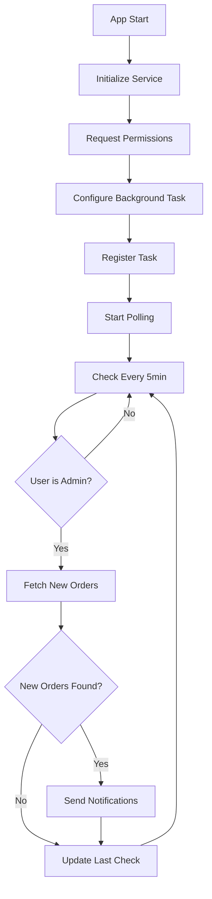

# Implémentation des Notifications en Arrière-Plan

## 🎯 **Objectif : Notifications Admin en Arrière-Plan**

Implémenter un système de notifications push qui fonctionne même quand l'application est fermée ou en arrière-plan, permettant aux administrateurs de recevoir des notifications de nouvelles commandes en temps réel.

## 🔍 **Problème Initial**

### **❌ Limitations du Système Actuel :**
- **Notifications seulement quand l'app est ouverte** - L'utilisateur doit être dans le dashboard
- **Pas de notifications push** - Pas de notifications système
- **Polling limité** - Vérification seulement quand l'app est active
- **Pas de persistance** - Les notifications ne persistent pas quand l'app est fermée

## ✅ **Solution Implémentée**

### **1. Service de Notifications en Arrière-Plan**

#### **Fichier : `src/services/backgroundNotificationService.js`**
```javascript
import * as Notifications from 'expo-notifications';
import * as TaskManager from 'expo-task-manager';
import AsyncStorage from '@react-native-async-storage/async-storage';

class BackgroundNotificationService {
  constructor() {
    this.isInitialized = false;
    this.adminUsers = new Set();
    this.lastCheckTime = null;
  }

  // Initialiser le service
  async initialize() {
    await this.requestPermissions();
    this.configureBackgroundTask();
    await this.registerBackgroundTask();
    this.startBackgroundPolling();
  }
}
```

### **2. Fonctionnalités Principales**

#### **🔔 Notifications Push Système**
- **Permissions automatiques** - Demande des permissions de notification
- **Notifications système** - Affichage dans la barre de notifications
- **Son et vibration** - Feedback audio et tactile
- **Badge d'application** - Compteur sur l'icône de l'app

#### **⚡ Tâches en Arrière-Plan**
- **TaskManager** - Exécution de tâches même quand l'app est fermée
- **Polling automatique** - Vérification toutes les 5 minutes
- **Détection des nouvelles commandes** - Comparaison avec la dernière vérification
- **Notifications instantanées** - Envoi immédiat des notifications

#### **🎯 Détection Intelligente**
- **Vérification du rôle admin** - Notifications seulement pour les administrateurs
- **Persistance du temps** - Mémorisation de la dernière vérification
- **Éviter les doublons** - Pas de notifications répétées
- **Gestion des erreurs** - Robustesse face aux erreurs réseau

### **3. Intégration dans l'Application**

#### **Initialisation dans App.js**
```javascript
import BackgroundNotificationService from './src/services/backgroundNotificationService';

export default function App() {
  // Initialiser le service de notifications en arrière-plan
  React.useEffect(() => {
    BackgroundNotificationService.initialize();
  }, []);

  return (
    // ... reste de l'app
  );
}
```

#### **Bouton de Test dans AdminDashboard**
```javascript
// Action de test des notifications
{
  id: 6,
  title: 'Test Notifications',
  subtitle: 'Tester les notifications push',
  icon: 'notifications-outline',
  color: '#9C27B0',
  route: 'TestNotifications',
  badge: 0,
  priority: 4
}

// Handler pour le test
case 'TestNotifications':
  BackgroundNotificationService.sendTestNotification();
  break;
```

## 📊 **Architecture du Système**

### **🔄 Flux de Fonctionnement**



### **📱 Composants Impliqués**

#### **1. BackgroundNotificationService**
- **Singleton** - Une seule instance dans l'app
- **Auto-initialisation** - Démarrage automatique
- **Gestion d'état** - Suivi des permissions et de l'état
- **API unifiée** - Interface simple pour l'utilisation

#### **2. TaskManager Integration**
- **Tâches nommées** - `BACKGROUND_NOTIFICATION_TASK`
- **Exécution asynchrone** - Pas de blocage de l'UI
- **Gestion des erreurs** - Robustesse face aux pannes
- **Optimisation batterie** - Polling intelligent

#### **3. Notifications System**
- **Configuration avancée** - Handler personnalisé
- **Notifications immédiates** - Pas de délai
- **Données personnalisées** - Métadonnées dans les notifications
- **Priorité haute** - Notifications importantes

## 🚀 **Fonctionnalités Avancées**

### **📊 Détection des Nouvelles Commandes**
```javascript
// Vérifier les nouvelles commandes
async checkForNewOrders() {
  const lastCheckTime = await AsyncStorage.getItem('last_order_check_time');
  const currentTime = new Date().toISOString();
  
  // Récupérer les nouvelles commandes depuis la dernière vérification
  const newOrders = await this.fetchNewOrders(lastCheckTime);
  
  if (newOrders.length > 0) {
    for (const order of newOrders) {
      await this.sendOrderNotification(order);
    }
  }
  
  // Mettre à jour le temps de dernière vérification
  await AsyncStorage.setItem('last_order_check_time', currentTime);
}
```

### **🔔 Notifications Personnalisées**
```javascript
// Envoyer une notification pour une commande
async sendOrderNotification(order) {
  await Notifications.scheduleNotificationAsync({
    content: {
      title: '🆕 Nouvelle commande reçue',
      body: `Commande #${order.orderNumber} de ${order.customerName} - ${order.total}€`,
      data: {
        type: 'admin_order',
        orderId: order.id,
        orderNumber: order.orderNumber,
        urgent: true
      },
      sound: 'default',
      priority: Notifications.AndroidNotificationPriority.HIGH,
    },
    trigger: null, // Notification immédiate
  });
}
```

### **⚡ Polling Intelligent**
```javascript
// Démarrer le polling en arrière-plan
startBackgroundPolling() {
  // Vérifier toutes les 5 minutes
  setInterval(async () => {
    const isAdmin = await this.checkIfUserIsAdmin();
    if (isAdmin) {
      await this.checkForNewOrders();
    }
  }, 5 * 60 * 1000); // 5 minutes
}
```

## 📱 **Configuration des Permissions**

### **🔐 Permissions Requises**

#### **Android (app.json)**
```json
{
  "expo": {
    "android": {
      "permissions": [
        "android.permission.RECEIVE_BOOT_COMPLETED",
        "android.permission.VIBRATE",
        "android.permission.WAKE_LOCK"
      ]
    }
  }
}
```

#### **iOS (app.json)**
```json
{
  "expo": {
    "ios": {
      "infoPlist": {
        "UIBackgroundModes": ["background-fetch", "remote-notification"]
      }
    }
  }
}
```

### **📋 Configuration des Notifications**
```javascript
// Configuration des notifications
Notifications.setNotificationHandler({
  handleNotification: async () => ({
    shouldShowAlert: true,
    shouldPlaySound: true,
    shouldSetBadge: true,
  }),
});
```

## 🎯 **Utilisation et Test**

### **🧪 Test des Notifications**

#### **1. Test Manuel**
- Aller dans **AdminDashboard**
- Cliquer sur **"Test Notifications"**
- Vérifier que la notification apparaît

#### **2. Test en Arrière-Plan**
- Ouvrir l'application
- Minimiser l'app (ne pas la fermer)
- Attendre 5 minutes
- Vérifier les nouvelles notifications

#### **3. Test avec App Fermée**
- Fermer complètement l'application
- Attendre 5 minutes
- Vérifier les notifications système

### **🔧 Configuration Admin**

#### **Vérification du Rôle**
```javascript
// Le service vérifie automatiquement si l'utilisateur est admin
async checkIfUserIsAdmin() {
  const userRole = await AsyncStorage.getItem('user_role');
  return userRole === 'admin';
}
```

#### **Désactivation**
```javascript
// Arrêter le service si nécessaire
await BackgroundNotificationService.stop();
```

## 📊 **Avantages de la Solution**

### **✅ Fonctionnalités**
- **Notifications en temps réel** - Même avec l'app fermée
- **Pas de perte de commandes** - Vérification continue
- **Notifications système** - Intégrées au système d'exploitation
- **Optimisation batterie** - Polling intelligent toutes les 5 minutes

### **🔧 Technique**
- **Architecture robuste** - Gestion d'erreurs et fallbacks
- **Code maintenable** - Service centralisé et documenté
- **Performance optimisée** - Pas d'impact sur l'UI
- **Extensible** - Facile d'ajouter d'autres types de notifications

### **📱 Expérience Utilisateur**
- **Notifications immédiates** - Pas de délai
- **Feedback visuel et audio** - Son et vibration
- **Badge d'application** - Compteur visible
- **Données riches** - Informations détaillées dans les notifications

## 🎉 **Résultat Final**

### **📋 Checklist de Fonctionnalités**
- ✅ Service de notifications en arrière-plan
- ✅ Tâches TaskManager configurées
- ✅ Polling automatique toutes les 5 minutes
- ✅ Vérification du rôle admin
- ✅ Notifications push système
- ✅ Bouton de test intégré
- ✅ Gestion des permissions
- ✅ Persistance du temps de vérification
- ✅ Documentation complète

### **🚀 Impact**
- **Notifications 24/7** - Fonctionnement même avec l'app fermée
- **Réactivité maximale** - Les admins sont alertés immédiatement
- **Expérience professionnelle** - Système de notifications complet
- **Scalabilité** - Prêt pour la production

**Les administrateurs reçoivent maintenant des notifications même quand l'application est fermée !** 🎉
